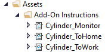
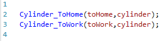

# ra-oop
Rockwell Automation Object Oriented Programming

Do you have a unreasonable need to upset your coworkers? You should try implementing object oriented programming and dependency injection in Rockwell Studio 5000 for them.
# How
Studio 5000 does not offer any object oriented programming features. There is no way to implement a class in Studio 5000. However, an approximation of OOP can be achieved in a similar fashion as it is done in C. A struct is used to house the object data and functions are used in place of methods. 

```C
struct thing_t{
	int things_internal_data;
}

int thing_dosomething(thing_t *thing_h, int parameter, int another_parameter);
```

The method is not a member of the struct so you can't do `thing_h.dosometing(1,2);` like you would in other languages. Instead the object instance is used a parameter of the function and passed as reference to the function like `thing_dosomething(%thing_h,1,2)`. In the end it achieved basically the same thing.

Studio 5000 does not have structs, pointers, or even functions, but it does have UDTs and AOIs which is what we're going to use.
## "Classes"
In C we get a tidy little file to house our "class". In Studio 5000 everything is global so we're going to make a bit of a mess. 
### "Methods"
The ~~methods~~ ~~functions~~ AOIs live in `Assets > Add-On Instructions`. For this demonstration we'll make a cylinder class. In order to make the cylinder work we'll need methods to go to work, go to home, and one for monitoring the IO.



We'll come back to these later.
### "Structs"
We're going to need a couple ~~structs~~ UDTs here. We need one for the object properties which we'll pass to the AOI just like the C example so it can access the properties belonging to the object. Put whatever properties you like in it. This is the only place where the cylinder object instance will have access to non-temporary variables. There is no way to specify public or private members so I put a `z` prefix on private ones since the list gets reordered alphabetically when accessing.


Make another one to register the ~~methods~~ ~~functions~~ AOIs we made earlier in. This is required because AOIs are not functions but behave more like Function Blocks and need pre-allocated memory.


One more UDT to combine the properties and methods into the class.


Why not just have one UDT containing the methods and the properties instead of defining three? We need to provide the method with a reference to the properties. If the methods were also provided to the method it would create a recursive reference which Studio 5000 will not abide.
### "Methods" Again
Now that we have the ~~structs~~ UDTs setup we can go back and provide the methods with their object reference.


## Implementation
In C, the pattern for calling an object's ~~method~~ function is:
`<funtion_name>(<object_pointer>,[arguments]);`

Here we need throw a little more boilerplate junk on it:
`<aoi_name>(<aoi_instance_tag>,<object_tag>,[arguments]);`

For example, a tag called `cylinderOne` of type `Cylinder_Class` would have method calls like this:


All you have to do now is fill out the guts of your ~~methods~~ ~~functions~~ AOIs and you've achieved... something.
### Self Methods
The method registry isn't passed to the method function AOI when it's called so it has no access to the memory for it's own the methods associated with the class. Declare the AOI locally instead like the logic in this AOI:


# Ladder Logic
Wow.


# Dependency Injection
Objects are cool and all but why bother with all this work making six definitions to instantiate a single cylinder? The answer is to make more objects and put those objects inside objects for other objects. Like this contraption that uses seven cylinders to do a thing.
![[Pasted image 20240601191203.png]]

Calling the seven cylinder thing's method.
![[Pasted image 20240601192132.png]]

Inside the seven cylinder do a thing's method.
![[Pasted image 20240601192231.png]]
## Self Method Injection
Sure, why not?
![[Pasted image 20240601194816.png]]
# Conclusion
I don't know what you're supposed to do with this information but if you made it down here it lives in your brain now. Good luck.
# Disclaimer
I never ran any of this. It compiles but was done just for fun.